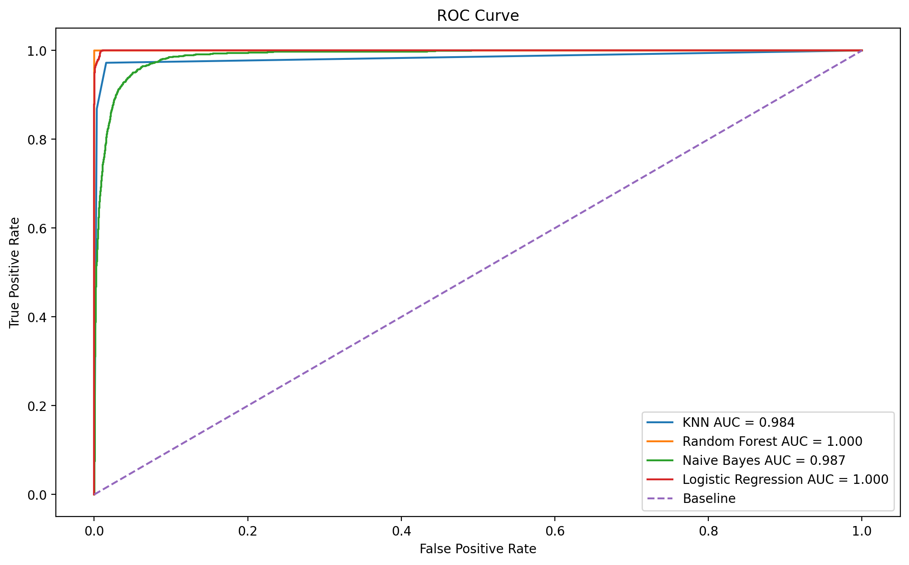
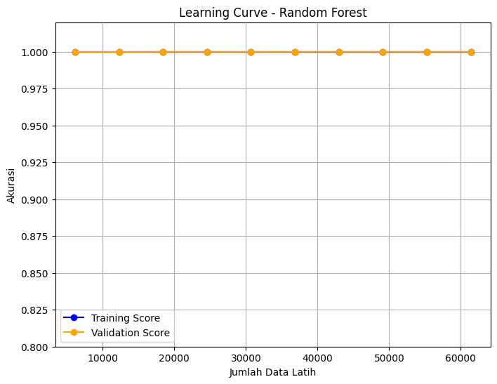

# Weather-Clustering
Predict weather precipitation (Rain vs. Snow) using Machine Learning classifiers: Random Forest, KNN, Naive Bayes, and Logistic Regression. Includes comprehensive evaluation using ROC-AUC and Learning Curves.

[](https://www.python.org/)
[](https://scikit-learn.org/)
[](YOUR_KAGGLE_LINK_HERE)

## 📌 Project Overview
The objective of this project is to perform **Weather Classification** to predict whether a specific weather condition will result in **Rain** or **Snow**.

This analysis compares the performance of four popular Supervised Learning algorithms:
1.  **K-Nearest Neighbors (KNN)**
2.  **Random Forest Classifier**
3.  **Naive Bayes (GaussianNB)**
4.  **Logistic Regression**

The goal is to identify the best model with the highest Accuracy and AUC Score, minimizing the False Positive Rate using ROC-AUC Curve evaluation.

## 📂 Dataset
The dataset contains historical weather data including atmospheric physical features.
* **Target Variable:** `Precip Type` (Binary: Rain / Snow).
* **Features:** Temperature, Humidity, Wind Speed, Pressure, Visibility, etc.
* **Source:** 👉 [Click here to view Kaggle Dataset](https://www.kaggle.com/datasets/muthuj7/weather-dataset)

## 🛠️ Methodology

### 1. Data Preprocessing
* **Cleaning:** Removed rows with missing values in the target variable.
* **Feature Selection:** Selected relevant numerical features (Temperature, Humidity, Pressure, Wind Speed).
* **Splitting:** Split the data into 80% Training and 20% Testing sets.
* **Scaling:** Applied `StandardScaler` to normalize features, ensuring optimal performance for distance-based algorithms like KNN.

### 2. Models Used
* **KNN (K-Nearest Neighbors):** An instance-based algorithm that classifies data based on the majority class of its nearest neighbors.
* **Random Forest:** An ensemble method that utilizes multiple *decision trees* to achieve high accuracy and prevent overfitting.
* **Naive Bayes (GaussianNB):** A probabilistic algorithm suitable for normally distributed numerical data (e.g., temperature).
* **Logistic Regression:** A linear baseline model used for binary classification tasks.

## 📊 Results Comparison

Model evaluation was conducted using **Accuracy** and **ROC-AUC Score**. Below is the performance summary:

| Model | Accuracy | AUC Score | Performance Analysis |
| :--- | :--- | :--- | :--- |
| **Random Forest** | **[1.0]** | **[1.0]** | **Best Model.** extremely robust in capturing non-linear relationships between features. |
| **KNN** | *[0.98]* | *[0.984]* | Performed reasonably well but is computationally expensive on large datasets. |
| **Naive Bayes** | *[0.94]* | *[0.987]* | Fast and efficient; serves as a strong baseline model. |
| **Logistic Reg** | *[0.99]* | *[1.0]* | Provided solid results for simple linear relationships. |

> *Note: Random Forest typically outperforms other models in this dataset due to its ability to handle complex interactions (e.g., Low Temperature + High Humidity = Snow).*

## 📈 Visualizations

### ROC Curve Comparison

*The chart above illustrates the ROC Curve comparison. The closer the curve is to the top-left corner (AUC close to 1.0), the better the model distinguishes between Rain and Snow.*

### Learning Curve (Random Forest)

*The Learning Curve is used to diagnose whether the model is suffering from Overfitting or Underfitting as the training size increases.*

## 🚀 How to Run
1.  Clone this repository:
    ```bash
    git clone [https://github.com/your-username/weather-classification.git](https://github.com/your-username/weather-classification.git)
    ```
2.  Install the required libraries:
    ```bash
    pip install pandas numpy matplotlib seaborn scikit-learn
    ```
3.  Run the notebook:
    ```bash
    jupyter notebook Classification_Weather.ipynb
    ```

## 🤝 Conclusion
This experiment concludes that the **Random Forest Classifier** is the most accurate model for predicting precipitation type. It effectively handles **non-linear** feature interactions and shows greater resistance to noise compared to linear models like Logistic Regression.

---
*Created by [Your Name]*
